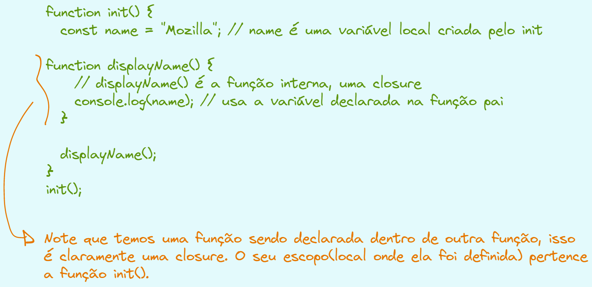
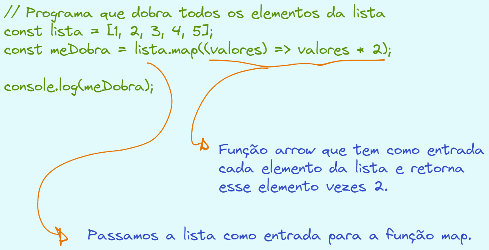
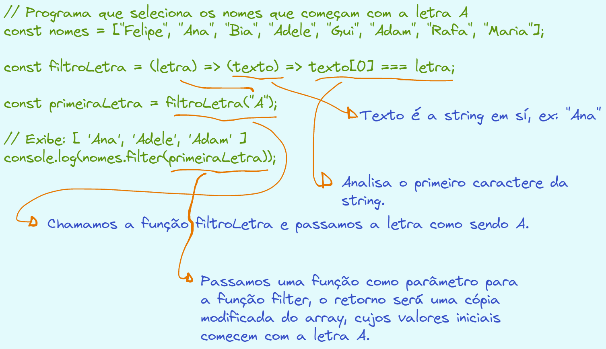

# Funções Puras

Dizemos que uma função é **pura** quando ela não depende de valores externos para realizar determinada tafera.

- Exemplo: Imagine uma função que calcula o raio de um círculo, onde a fórmula é dada por PI \* RAIO \* RAIO

```js
// Variável global(externa)
const PI = 3.14;

const calculaRaio = (raio) => {
  // Passamos a variável global PI para a função.
  return raio * raio * PI;
};

console.log(calculaRaio(2));
```

No exemplo acima temos que a função calculaRaio() depende de uma variável externa **PI** para realizar o seu cálculo, chamamos essa função de função impura.

Para resolver esse problema, basta colocar a variável PI como parâmetro dentro da função.

```js
// Passamos PI como parâmetro para a função e definimos seu valor como sendo 3.14
const calculaRaio = (raio, PI = 3.14) => {
  // Retorna o cálculo do raio.
  return raio * raio * PI;
};
// Exibe 12.56
console.log(calculaRaio(2));
```

Como visto acima, para resolver o problema da pureza basta passar PI como parâmetro para a função. Dessa forma, a função não sofre efeitos externos, ou seja, o que entra é computado de forma adequada e retorna o valor computado sem sofrer nenhuma mutação.

Podemos também usar variáveis locais, ou seja, dentro da função. Dessa forma a pureza é alcançada.

```js
// Passamos PI como parâmetro para a função e definimos seu valor como sendo 3.14
const calculaRaio = (raio) => {
  // Declaramos e definimos o valor de PI
  const PI = 3.14;
  // Retorna o cálculo do raio.
  return raio * raio * PI;
};
// Exibe 12.56
console.log(calculaRaio(2));
```

Note que no exemplo acima PI é uma variável local, ou seja, está dentro da função. Portanto, essa função continua sendo pura pois não depende de fatores externos.

# Cidadãs de Primeira Classe

Dizemos que uma função é uma cidadã de primeira classe **quando é possível armazenar seu valor em uma variável e o tipo de dado dessa variável ser do tipo function(função.)**

```js
// Uma variável qualquer, seu tipo de dado é string.
const primeiroNome = "Douglas";
// Uma variável qualquer, seu tipo de dado é Number.
const idade = 22;

// Uma variável qualquer, seu tipo de dado é FUNCTION(função)
const imprimeAlgo = () => {
  console.log("Olá, tudo bem?");
};
// Olá, tudo bem?
imprimeAlgo();
// Retorna function, que é o seu tipo de dado.
console.log(typeof imprimeAlgo);
```

Ou seja, uma **função é uma cidadã de primeira classe quando ela é tratada como um valor e é armazenada em uma variável como se fosse um valor qualquer.** Para um maior aprofundamento visite a documentação [Função First-class
](https://developer.mozilla.org/pt-BR/docs/Glossary/First-class_Function)

# Funções de Alta Ordem

Funções de alta ordem **são funções que aceitam outras funções como argumento e podem ou não retornar novas funções como resultado de sua execução.**

- Por exemplo, imagine que temos duas funções, somar() e multiplicar() e uma terceira função chamada executar que recebe como argumento uma outra função.

```js
function somar(a, b, c) {
  return a + b + c;
}

function multiplicar(a, b) {
  return a * b;
}

// Recebe uma função como argumento.
function executar(funcao, ...parametros) {
  // Retorna uma função
  return function (textoInicial) {
    return `${textoInicial} ${funcao(...parametros)}`;
  };
}

// Passamos a função somar como argumento
const respostaUm = executar(somar, 4, 5, 6)("O resultado da soma é: ");
// Passamos a função multiplicar como argumento.
const respostaDois = executar(
  multiplicar,
  30,
  40
)("O resultado da multiplicação é: ");

console.log(respostaUm);
console.log(respostaDois);
```

No exemplo acima temos claramente um exemplo de função de alta ordem, note que a **função executar recebe como argumento uma outra função, e ao mesmo tempo, tem como retorno uma outra função.**

# Princípio da Imutabilidade

A imutabilidade é uma propriedade que garante que os elementos não tenham seu valor alterado por qualquer ação. Por exemplo uso de expressões ou aplicações de outras funções. Essa propriedade evita que nosso código sofra alterações indesejadas.

- Por exemplo, digamos que temos dois arrays, listaUm e listaDois, poderiamos atribuir a listaUm a listaDois?

```js
const listaUm = [3, 1, 7, 9, 4, 6];
const listaDois = listaUm;

// Exibe [ 3, 1, 7, 9, 4, 6 ]
console.log(listaDois);
```

Note que no exemplo acima a variável listaDois possui os mesmos valores que a listaUm. Já no exemplo abaixo, usamos o método sort que ordenada a lista, no entanto ordenamos a lista de forma crescente.

```js
const listaUm = [3, 1, 7, 9, 4, 6];
const listaDois = listaUm.sort((a, b) => a - b);
// Exibe [ 1, 3, 4, 6, 7, 9 ]
console.log(listaDois);
// Exibe [ 1, 3, 4, 6, 7, 9 ]
console.log(listaUm);
```

Note que usamos uma função dentro de outra função, e ordenamos ela da forma a - b, isso significa dizer que queremos uma ordenação crescente(do menor valor para o maior valor). Ou seja, a listaUm também foi ordenada pois os arrays não são imutáveis.

Para garantir a imutabilidade dos arrays, podemos **congelar** seus valores usando a função Object.Freeze(nome_do_array);

```js
// Usando a função Object.freeze para congelar os valores do array.
const listaUm = Object.freeze([3, 1, 7, 9, 4, 6]);
// Tentamos ordenar a listaUm
const listaDois = listaUm.sort((a, b) => a - b);

console.log(listaDois);
console.log(listaUm);
```

O exemplo acima irá gerar um erro pois estamos tentando modificar o array listaUm, no entanto seus valores são imutáveis, ou seja, estão congelados por conta da função Object.freeze. Uma forma de resolver esse problema seria passar o arrayUm dentro de um outro array, usando o operador spread.

```js
// Usando a função Object.Freeze para congelar os valores do array.
const listaUm = Object.freeze([3, 1, 7, 9, 4, 6]);
// Armazenamos a listaUm em um novo array usando o operador spread e em seguida ordenamos.
const listaDois = [...listaUm].sort((a, b) => a - b);
// Exibe [ 1, 3, 4, 6, 7, 9 ]
console.log(listaDois);
// Exibe [ 3, 1, 7, 9, 4, 6 ]
console.log(listaUm);
```

O exemplo acima é válido e preserva a imutabilidade da listaUm. Note que usamos o operador spread dentro do array para poder armazenar todos os valores ordenados dentro do novo array. Basicamente criamos a definição de um novo array.

Talvez você esteja se perguntando, e as funções de alta ordem **map, filter e reduce** elas ferem o princípio da imutabilidade? A resposta é não, pois **map e filter geram uma cópia da lista original como resultado, já a função reduce gera um valor como resultado.**

# Closure

Closure tem relação ao escopo onde ela está definida, por exemplo, uma função dentro de outra função tem como escopo(local onde ela está definida e atua sobre) a função mais externa. Vamos ver um exemplo na prática.



No exemplo acima temos que a função displayName() permite acessar uma função externa, pois ela é uma função interna, uma closure. A função displayName() está disponível apenas dentro da função init(), não podendo ser acessada externamente.

# Currying

Currying é uma forma de reescrever nossas funções, permitindo a passagem de parâmetros de forma gradual.

```js
// Declaração padrão de uma função
function operacao(a, b, c) {
  return a * (b - c);
}

// Declaração usando o conceito de currying
function operacaoCurrying(a) {
  return function (b) {
    return function (c) {
      return a * (b - c);
    };
  };
}

console.log(operacaoCurrying(4)(3)(1));
```

Note que no exemplo acima primeiro passamos todos os argumento em um único parênteses, já no segundo caso, cada argumento pertence a parêntese da função passada, nesse caso a, b e c. Ou seja, isso nos permite passar parâmetros de forma gradual conforme necessário. Uma outra forma de reescrever o exemplo acima é usando a notação Arrow Function.

```js
const operacaoCurrying = (a) => (b) => (c) => a * (b - c);
```

Note que a cada passagem de parâmetro temos um determinado retorno.

Imagine que queremos fazer o reuso da função operacaoCurrying. Para isso vamos criar uma função chamada dobro.

```js
const operacaoCurrying = (a) => (b) => (c) => a * (b - c);
// Passamos os valores de a e b.
const dobro = operacaoCurrying(-2)(0);
// Temos a seguinte expressão: -2 * (0 - 10) = 20.
console.log(dobro(10));
```

# Função de Alta Ordem Map()

A função map tem como **parâmetro uma outra função que realiza seu cálculo e retorna algo. A função map tem como entrada uma lista e retorna uma cópia da lista original, ou seja, a lista original não é modificada. A função map é muit útil para quando quisermos transformar cada valor da lista em um novo valor.**

```js
// Programa que dobra todos os elementos da lista
const lista = [1, 2, 3, 4, 5];
const meDobra = lista.map((valores) => valores * 2);
// Exibe: [ 2, 4, 6, 8, 10 ]
console.log(meDobra);
```



O exemplo acima está bem explicadinho, basicamente a função map tem uma outra função dentro de sí, que realiza o cálculo para cada elemento do array e retorna uma cópia modificada do array original.

```js
// Programa que extrai a inicial de cada nome
const nomes = ["Ana", "Bia", "Gui", "Lia", "Rafa"];

// Pega somente a primeira letra.
const extraiPrimeiraLetra = (texto) => texto[0];
// Passamos a função extraiPrimeiraLetra como parâmetro.
const iniciais = nomes.map(extraiPrimeiraLetra);
// Exibe: [ 'A', 'B', 'G', 'L', 'R' ]
console.log(iniciais);
```

No exemplo acima temos que para cada elemento do array,a função extraiPrimeiraLetra irá pegar somente o primeiro caractere, por fim retorna uma cópia modificada do array original.

# Função de Alta Ordem Filter()

A função **filter serve para filtrar elemento em um determinado array. O retorno da função filter é uma cópia modificada do array, com os valores filtrados.**

```js
// Programa que seleciona os nomes que começam com a letra A
const nomes = ["Felipe", "Ana", "Bia", "Adele", "Gui", "Adam", "Rafa", "Maria"];

const filtroLetra = (letra) => (texto) => texto[0] === letra;

const primeiraLetra = filtroLetra("A");
// Exibe: [ 'Ana', 'Adele', 'Adam' ]
console.log(nomes.filter(primeiraLetra));
```



No exemplo acima temos que a função filtroLetra irá receber a letra que desejamos filtrar e em seguida, recebe uma string(nesse caso o nome), por fim retorna o primeiro caractere de cada string. Em seguida, chamamos a função filtroLetra passando a letra A como argumento, por fim usamos o console.log para imprimir o valor e chamamos o método filter, que tem como parâmetro a função primeiraLetra, que será responsável por filtrar os elementos cujo caractere inicial começa com A.


[Voltar](README.md);
