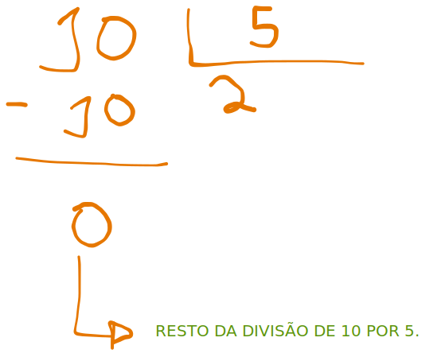
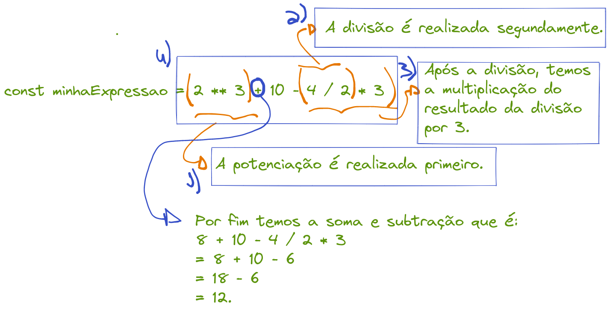
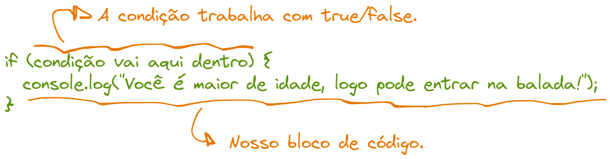
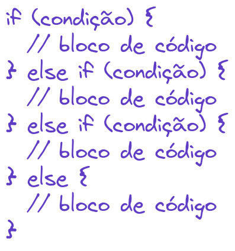
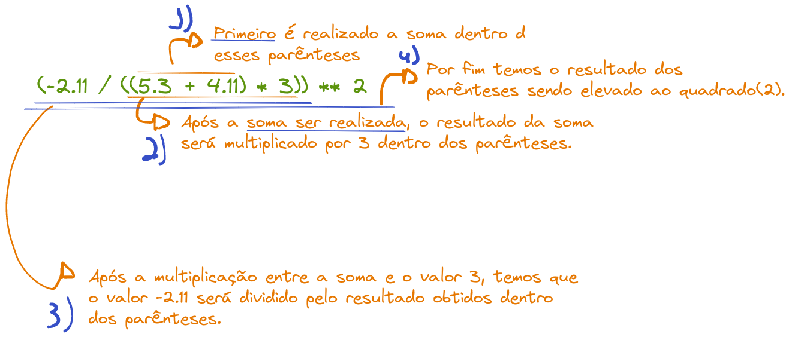
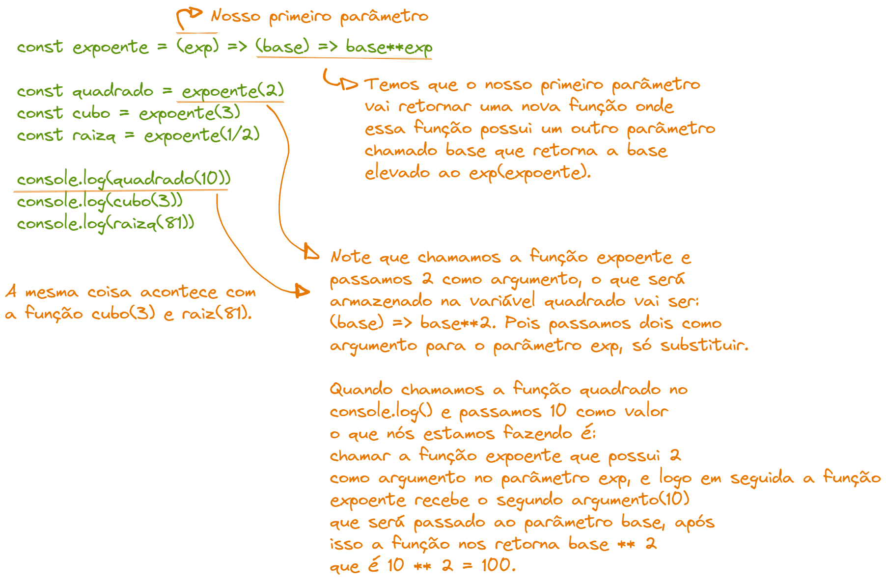

# Programação Funcional

- **Programação funcional** é um dos **paradigmas** existentes no campo da programação. Além do paradigma funcional temos o **Imperativo** e o **Orientade a Objetos**.

- Na programação Funcional nós trabalhamos com o conceito de **funções que executam determinada tarefa**, por exemplo

  ```javascript
  // Declaração de função
  function somaDeDoisNumeros(numeroUm, numeroDois) {
    // Exibe a mensagem com o resultado da soma
    console.log("A soma é: ", numeroUm + numeroDois);
  }

  // Chamamos a função para executar a sua tarefa
  // Nesse caso, somar dois números.
  somaDeDoisNumeros(2, 3); // A soma é:  5
  ```

- Note que no exemplo acima nós fizemos uso da **palavra-reservada function** e em seguida, atribuimos um **nome a nossa função** que se chama **somaDeDoisNumeros**. Após isso, abrimos os **parênteses** que representam a função e atribuimos dois **parâmetros dentro dos parênteses**, nesse caso as **variãveis numeroUm e numeroDois**. Após isso, **dentro das chaves** nós temos o nosso **bloco de código** que é onde escrevemos o nosso código de fato. O que o nosso bloco de código faz é **imprimir na tela** o resultado da soma dos dois parâmetros(numeroUm e numeroDois). Após isso nós fazemos a **chamada da função** digitando o seu nome e colocando parênteses, após isso a função é executada e imprime o resultado da soma na tela.

- O exemplo acima é apenas uma forma simples de abordar o assunto de funções, veremos mais para a frente a forma correta de trabalhar com **funções puras**.

## Conceito de variável

- Podemos imaginar uma variável como sendo uma gaveta do nosso guarda-roupa, ou seja, essa gaveta serve para armazenar coisas, como camisas, shorts, tênis etc. Uma variável faz basicamente esse papel de armazenar coisas, nesse caso **dados**. Cada **variável armazena um dado na memória do nosso computador**. Vejamos um exemplo

* ```javascript
  let meuNome = "Douglas";
  console.log(meuNome); // Irá exibir Douglas na tela.
  ```

# Tipos de dados primitivos em JavaScript

- JavaScript possui **sete tipos de dados primitivos**, sendo eles:

  - Boolean: São representados pelos valores lógicos **true** e **false**.

  - Null: Basicamente significa nulo, ou seja, nada.

  - Undefined: Significa indefinido, ou seja, algo que não possui 'valor', ou melhor, algo que ainda não foi atribuido.

  - BigInt: Trabalha com valores inteiros muito grandes.

  - String: Strings são uma cadeia de caracteres, ou seja, palavras que são colocadas entre aspas simples ou duplas.

  - Symbol: Não há necessidade de estudar no momento.

  - Object: Não há necessidade de estudar no momento.

## Formas de declarar uma variável usando let e const.

- Em JavaScript é possivel declarar variáveis utilizando as **palavras-reservadas let e const**. De forma simplificada, a diferença entre let e const se dá sobre o conceito de imutabilidade/mutabilidade. Imutabilidade quer dizer que a função é uma constante, ou seja, ela não pode ser reatribuida(mudar o seu valor de origem). Já a mutabilidade é o oposto da imutabilidade, ou seja, é possivel reatribuir valores a variável. Nesse sentido, a palavra-reservada const é imutável, ou seja, é uma constante. Já a palavra-reservada let é mutável, logo, é possivel reatribuir novos valores a variável, vejamos

  ```javascript
  // A variável meuNome é uma constante, logo, imutável.
  const meuNome = "Douglas";
  // A variável minhaIdade é mutável.
  let minhaIdade = 22;
  // Exibe Douglas na tela.
  console.log(meuNome);
  // Exibe 22 na tela.
  console.log(minhaIdade);
  ```

- Note que no exemplo acima meuNome foi declarado utilizando a palavra-reservada **const** pois meu nome não é algo que iremos mudar, ou seja, reatribuir. Já a variável minhaIdade foi declarada usando a palavra-reservada **let** pois minhaIdade muda com o passar dos anos, ou seja, podemos reatribuir(mudar) os valores da variável.

* Vejamos um exemplo em que resultará em um erro.

  ```javascript
  const meuNome = "Douglas";
  // Reatribuimos um novo valor a variável meuNome
  meuNome = "Doug"; // Resultará em um error

  let minhaIdade = 22;
  minhaIdade = 23; // Podemos reatribuir tranquilamente utilizando let.
  ```

- Note que no exemplo acima tentamos reatribuir "Doug" a variável meuNome que foi declarada usando const, ou seja, uma constante. Isso resultará em um **error** pois const é imutável, ou seja, não é possivel fazermos uma reatribuição da variável.

* Exemplo envolvendo os **principais tipos de dados** existentes na linguagem JavaScript

  ```javascript
  // Tipo de dado: String
  const meuNome = "Douglas";

  // Tipo de dado: Int(Inteiro)
  let minhaIdade = 22;

  // Tipo de dado: Booleano(Valor lógico)
  const souLindo = true;

  // Tipo de dado: Float/Double(Decimal)
  const valorDoPI = 3.1415;
  ```

- Note que utilizamos **ponto no lugar de virgula para separar as casas decimais**, isso se deve por conta do **padrão dos Estados Unidos**.

# Funções como expressões

- Uma função como expressão é uma forma da gente **armazenar o valor de uma função em uma variável**, vejamos isso

  ```javascript
  const somaDoisNumeros = (numeroUm, numeroDois) => {
    return numeroUm + numeroDois;
  };

  console.log("A soma é: " + somaDoisNumeros(2, 3)); // A soma é: 5
  ```

- Para entender o exemplo acima vamos analisar passo a passo. Note que declaramos uma **variável chamada somaDoisNumeros** utilizando a palavra-chave **const**, ou seja, uma constante. Logo em seguida fazemos uso do **operador de atribuição =** e abrimos **parênteses da função, onde declaramos dois parâmetros numeroUm e numeroDois** que irão **receber informações ao chamarmos a função**. Após isso, fazemos uso da **notação arrow function(notação de flexa) que é representada pelos símbolos =>** e abrimos chaves. Dentro das **chaves é o nosso bloco de código que é onde iremos escrever as intruções da nossa função, ou seja, o que a nossa função vai fazer**. Após isso temos uma **palavra-reservada chamada return que significa retorne/retornar**, ela basicamente **retorna a soma entre os dois parâmetros(variáveis) numeroUm e numeroDois**. Após isso, fazemos uso da **função console.log() e criamos uma string e concatenamos(juntamos) a string com o valor de retorno da nossa função após a sua chamada**. Note que os valores **2 e 3 dentro dos parênteses são chamados de argumentos**, ou seja, são os **valores que passamos para os parâmetros da nossa função(numeroUm e numeroDois)**.

* Quando utilizamos a palavra-chave **return** nós estamos fazendo uso do conceito de função como retorno, que é basicamente uma função que retorna algo após a sua execução.

# Ordem de precedência dos operadores aritméticos

- Ordem de precedência basicamente significa dizer quais **operações vão ser realizadas primeiro**, a ordem é

  - 1º: **Potenciação ou Radiciação**
  - 2º: **Multiplicação ou Divisão**
  - 3º: **Adição ou Subtração**

- Vejamos alguns exemplos

  ```javascript
  // Potenciação

  // Elevamos a base(numeroQuadrado) ao expoente 2
  const numero = 2;
  const numeroQuadrado = numero ** 2;
  // O resultado será 4, pois 2 * 2 é 4.
  console.log(numeroQuadrado);

  // Radiciação usando a função Math.sqrt()
  const radicando = 16;
  // A função .sqrt da biblioteca Math retorna o valor da raiz de um numero.
  const raizQuadrada = Math.sqrt(radicando);
  // Exibe 4, pois a raiz quadrada de 16 é 4.
  console.log(raizQuadrada);

  // Multiplicação
  const numeroUm = 2;
  const numeroDois = 5;
  // Multiplicamos o valor das duas variáveis
  const resultado = numeroUm * numeroDois;
  // Exibe o valor 10, que é a multiplicação 2 * 5
  console.log(resultado);

  // Divisão
  const num1 = 10;
  const num2 = 2;
  // Dividimos o valor 10 / 2.
  const result = num1 / num2;
  // Exibe o valor 5, que é o resultado da divisão 10 / 2.
  console.log(result);

  // Adição e Subtração
  const n1 = 10;
  const n2 = 5;
  const n3 = 2;
  // O resultado é 10 + 5 - 2 = 13.
  const result1 = n1 + n2 - n3;
  // Exibe o resultado que é 13.
  console.log(result1);
  ```

- O exemplo acima aborda os **4 operadores aritméticos e os operadores de potenciação e radiciação**. Veremos agora o operador de módulo. O operador de **módulo retorna o resto da divisão de dois números**.

- O exemplo abaixo trata do operador de módulo que é o resto da divisão entre 10 e 5.
  ```javascript
  const numero1 = 10;
  const numero2 = 5;
  // O resto da divisão de 10 por 5 é 0.
  const moduloNumero = numero1 % numero2;
  // Exibe 0 que é o resto da divisão entre 10 e 5.
  console.log(moduloNumero);
  ```
- Para visualizar isso melhor, vamos ver um exemplo gráfico.
  

- Agora vamos ver a ordem de precedência em ação

  ```javascript
  const minhaExpressao = 2 ** 3 + 10 - (4 / 2) * 3;
  // Exibe 12.
  console.log(minhaExpressao);
  ```

- Vamos entender essa ordem de precedência visualmente.
  

# Estrutura condicional

- A estrutura condicional é uma estrutura que trabalha com **condições para executar determinada tarefa**. Por exemplo, imagine que a condição de uma pessoa entrar em uma balada seria ela ser maior de idade, ou seja, ter **idade maior ou igual a 18**.

## Estrutura condicional if-else

- Vejamos um exemplo gráfico dessa estrutura
  

* Note que fazemos uso da **palavra-reservada if** em seguida **abrimos parênteses e colocamos nossa condição dentro**. Essa condição será **analisada** pela estrutura if e caso o valor **lógico dela seja true(verdade) temos que o nosso bloco de código dentro das chaves será executado**, ou seja, a função console.log() irá imprimir a string(frase) Você é maior de idade, logo pode entrar na balada!

* Vamos fazer nosso programa descrito acima.

  ```javascript
  const podeEntrar = (minhaIdade) => {
    // Fazemos analise do parâmetro minhaIdade
    if (minhaIdade >= 18) {
      console.log("Você é maior de idade, logo pode entrar na balada!");
    } else {
      console.log("Você é menor de idade, logo não pode entrar na balada!");
    }
  };

  // Chamamos a função e passamos uma idade.
  // 22 é maior ou igual a 18, logo a condição if é true.
  podeEntrar(22); // Exibe Você é maior de idade, logo pode entrar na balada!

  // Como 17 é menor ou igual a 18, temos que a estrutura if será falsa, logo não
  // será executada. Ou seja, como if não será executada
  // Temos que o else(senão) será executado.
  podeEntrar(17); // Você é menor de idade, logo não pode entrar na balada!
  ```

* Note que no exemplo acima fizemos uso da **estrutura if-else(se-senão)**, ou seja, essa estrutura funciona **analisando uma condição**, caso a condição seja **true** temos que o nosso if **irá executar o seu bloco de código**, caso a condição seja **falsa** temos que o **else irá executar o seu bloco de código**. Ou seja, caso o **if seja falso temos que ele não será executado**, logo o que sobra é o **else que irá executar sempre que o nosso if for false**.

## Estrutura condicional múltipla

- A **estrutura condicional múltipla testa vários casos até que uma condição seja aceita**, essa estrutura funciona da seguinte forma, vejamos graficamente



- Note que temos um novo comando que é o **else if(senão se)**, ou seja, caso o primeiro if não seja true temos que o proximo comando else if será executado e assim por diante. Caso nenhuma condição seja true(verdadeira) temos que a última estrutura else(senão) será executada. Vamos ver essa estrutura em prática fazendo uso de um programinha que calcula o seu IMC?

<br>

- O índice de massa corporal é um indicador que serve para avaliar o peso do individuo, permitindo avaliar se está com excesso de peso ou obesidade.

- Podemos calcular o IMC dividindo o peso (em Kilogramas) pela altura (em metros) ao quadrado. Ou seja, a fórmula do IMC é a seguinte:

- IMC = Peso (kg) / Altura (m)2

- Exemplo: Uma pessoa com 60kg e que meça 1,60 m, possui um IMC de 23,4.

  ```javascript
  const exibeIMC = (peso, altura) => {
    // O imc é calculado dividindo o seu peso pelo quadrado da sua altura.
    const calculoIMC = peso / (altura * altura);

    if (calculoIMC < 18.5) {
      console.log("O seu índice de massa corporal é: " + calculoIMC);
      console.log("Baixo peso!");
    } else if (calculoIMC < 24.9) {
      console.log("O seu índice de massa corporal é: " + calculoIMC);
      console.log("Peso normal!");
    } else if (calculoIMC < 29.9) {
      console.log("O seu índice de massa corporal é: " + calculoIMC);
      console.log("Excesso de peso!");
    } else if (calculoIMC < 34.9) {
      console.log("O seu índice de massa corporal é: " + calculoIMC);
      console.log("Obesidade grau I (Moderada)!");
    } else if (calculoIMC < 39.9) {
      console.log("O seu índice de massa corporal é: " + calculoIMC);
      console.log("Obesidade grau II (Severa)!");
    } else {
      console.log("O seu índice de massa corporal é: " + calculoIMC);
      console.log("Obesidade grau III (Mórbida)!");
    }
  };

  // Chamamos a função e passamos o peso e nossa altura
  // Exibe: O seu índice de massa corporal é: 23.25501863821347
  // Peso normal!
  exibeIMC(68, 1.71);

  // Testando vários valores

  // O seu índice de massa corporal é: 25.64891761567662
  // Excesso de peso!
  exibeIMC(75, 1.71);

  // O seu índice de massa corporal é: 31.120686707020965
  // Obesidade grau I (Moderada)!
  exibeIMC(91, 1.71);

  // O seu índice de massa corporal é: 35.90848466194727
  // Obesidade grau II (Severa)!
  exibeIMC(105, 1.71);

  // O seu índice de massa corporal é: 44.45812386717281
  //Obesidade grau III (Mórbida)!
  exibeIMC(130, 1.71);

  // O seu índice de massa corporal é: 15.389350569405973
  // Baixo peso!
  exibeIMC(45, 1.71);
  ```

- Note que no exemplo acima meu IMC foi aproximadamente 23.25, ou seja, caiu na segunda condição que é calculoIMC < 24.9.

* NOTA: Os exemplos acima estão sendo feitos de forma simples para melhor entendimento, futuramente veremos como retornar strings usando o comando return dentro da função.

# Primeira e Terceira Listas de Exercício

## Primeira Lista

- Resolução da **primeira lista**

  ```javascript
  /*
  Q1. Observe os exemplos a seguir e teste-os em um console Javascript de um browser de sua preferência
  
  1) Operações aritméticas
  */

  // Armazena o cálculo da expressão a direita.
  const operacoesAritmeticas = (-2.11 / ((5.3 + 4.11) * 3)) ** 2;
  // Exibe o resultado.
  console.log(operacoesAritmeticas); // Exibe: 0.005586543107958022
  ```

- Visualmente temos a resolução sendo executada da seguinte forma
  

- Preste atenção a ordem de precedência dos operadores e os parênteses mais internos.

* A seguir temos a resolução dos itens 2 e 3 da questão 1

  ```javascript
  /*
  Q1. Observe os exemplos a seguir e teste-os em um console Javascript de um browser de sua preferência
  
  2) Criação de constantes
  */

  const a = 5;
  const b = 3;
  // Primeiro é realizado a soma(a + b) = 5 + 3 = 8
  // Depois temos a multiplicação 2 * 8 = 16.
  const resultado = 2 * (a + b);
  console.log(resultado); // Exibe 16.
  ```

- Anteriormente vimos a estrutura if e como ela funciona, vamos aplicar ela no exemplo 3 da questão 1.

  ```javascript
  /*
  Q1. Observe os exemplos a seguir e teste-os em um console Javascript de um browser de sua preferência
  
  3) Expressões condicionais
  */

  const a = 5;
  const b = 3;
  // Primeiro é realizado a soma(a + b) = 5 + 3 = 8
  // Depois temos a multiplicação 2 * 8 = 16.
  const resultado = 2 * (a + b);
  console.log(resultado); // Exibe 16.

  // Exibe aprovado, pois a(5.0) é maior ou igual a 5.
  if (a >= 5.0) {
    console.log("Aprovado");
  } else {
    console.log("Reprovado");
  }
  ```

- Note que no exemplo acima o valor da variável a é 5, logo a condição dentro da estrutura if é verdadeira(true), ou seja, o seu bloco de código é executado, nesse caso a função console.log().

* No exemplo 4 da questão 1 temos uma manipulação envolvendo strings(textos).

  ```javascript
  /*
  Q1. Observe os exemplos a seguir e teste-os em um console Javascript de um browser de sua preferência
  
  4) Manipulação de texto
  */

  let nome = "Fulano";
  let sobrenome = "Santos";

  // Realizamos uma concatenação(junção/união) de strings.
  let resultado = nome + " " + sobrenome;
  // Exibe: Fulano Santos
  console.log(resultado);

  // Usando os índices(posições) de cada letra na string
  resultado = nome[0] + sobrenome[0];
  // Índice 0 é a primeira letra tanto do nome como sobrenome
  console.log(resultado); // Exibe: FS
  ```

- Como dito acima, concatenação é uma forma da gente unir/juntar textos(strings). Além disso trabalhamos com os índices(posições) de cada letra da string utilizando colchetes e sua posição.

## Antes de proseguirmos para a terceira lista, vamos estudar o conceito de função como retorno

- Uma função como retorno é basicamente uma função que retorna outra função como resultado, vemos ver um exemplo para melhor entendimento

  ```javascript
  const expoente = (exp) => (base) => base ** exp;

  const quadrado = expoente(2);
  const cubo = expoente(3);
  const raizq = expoente(1 / 2);

  console.log(quadrado(10));
  console.log(cubo(3));
  console.log(raizq(81));
  ```

- Visualmente temos
  

- No exemplo acima a variável **quadrado armazena o resultado da expressão** (base) => base \*\* exp, ou seja, armazena uma função como valor.


# Definição de Função como Retorno

```js
// Note que desagregamos os parâmetros.
const potencia = (base) => (expoente) => base ** expoente;
// Passamos 5 como argumento para o parâmetro base e 3 como
// argumento para o parâmetro expoente.
const respostaUm = potencia(5)(3);
console.log(`O resultado é: ${respostaUm}`);

const respostaDois = potencia(81)(1 / 2);
console.log(`O resultado é: ${respostaDois}`);

const respostaTres = potencia(2)(-1);
console.log(`O resultado é: ${respostaTres}`);

// [EXEMPLO] Defina funções para calcular o quadrado, o cubo e a
// raiz quadrada de um número passado
// como argumento reaproveitando uma definição de função genérica chamada expoente.

// Passamos primeiro o expoente que queremos.
const expoente = (expoente) => (base) => base ** expoente;
// Retorna (base) => base ** 2
const quadrado = expoente(2);
// Retorna (base) => base ** 3
const cubo = expoente(3);
// Retorna (base) => base ** 1/2
const raizQuadrada = expoente(1 / 2);

console.log(`\nO resultado é: ${quadrado(10)}`);
console.log(`\nO resultado é: ${cubo(3)}`);
console.log(`\nO resultado é: ${raizQuadrada(81)}`);
```

# Definição de Função como Argumento

```js
// Definição de função como argumento

// Se uma função é um valor então temos que ela
// pode ser passada como argumento para outras funções.

// Note que declaramos várias funções básicas
const subtrair = (x, y) => x - y;
const somar = (x, y) => x + y;
const multiplicar = (x, y) => x * y;
const divir = (x, y) => x / y;
const concatenar = (x, y, sep = " ") => x + sep + y;
const iniciais = (x, y) => x[0] + y[0];
// const negativo = subtrair(0, y);

// Note que temos um f ali entre parênteses, isso significa
// que estamos passando uma função como argumento para outra função.
const exec = (f, x, y) => f(x, y);

// Passando função como argumento para a função exec
// Chama a função subtrair e passa 50, 25 como argumento para x, y.
const resposta1 = exec(subtrair, 50, 25);

const resposta2 = exec(somar, 50, 25);

const resposta3 = exec(multiplicar, 50, 25);

const resposta4 = exec(divir, 50, 25);

const resposta5 = exec(concatenar, "Isaac", "Newton");

const resposta6 = exec(iniciais, "Isaac", "Newton");

// Note que todas as funções acima receberam uma outra função como argumento.
console.log(`\nO resultado é: ${resposta1}`);
console.log(`O resultado é: ${resposta2}`);
console.log(`O resultado é: ${resposta3}`);
console.log(`O resultado é: ${resposta4}`);
console.log(`O resultado é: ${resposta5}`);
console.log(`O resultado é: ${resposta6}`);
```

No exemplo acima temos que ao chamarmos a função resposta1 ela irá chamar a funçao exec() que realiza a chamada da função passada como argumento, nesse caso subtrair() e logo em seguida passamos 50 e 25 como argumentos para os parêmtros x e y. Após isso, a função resposta1 retorna uma outra função que é a função subtrair, mas antes ela realiza a chamada da função subtrair que executa sua tarefa. Por fim, a função exec retorna o valor de sua operação.

## Função Anônima

```js
// Funções anônimas

// Podemos definir uma função qualquer apenas no momento de seu uso, ou seja
// não é necessário atribuir um nome a ela.

// [EXEMPLO: Lista 02, Q12] Escreva um programa para calcular o maior
// e o menor valor real das raízes de uma equação de segundo grau.

// Temos os três argumentos a b c e retornamos uma função.
const raiz = (a, b, c, f) => {
  // Realiza o cálculo do delta.
  const delta = b ** 2 - 4 * a * c;
  // Faz uma análise do delta caso negativo.
  if (delta < 0) return undefined;

  // Armazena os valores das raízes.
  const positivo = (-b + delta) / (2 * a);
  const negativo = (-b - delta) / (2 * a);
  // Retorna uma função que foi passada como argumento.
  return f(positivo, negativo);
};

// Valores como argumento
const a = 1;
const b = -5;
const c = 6;

// Chamamos a função e realizamos a checagem das raízes.
// x e y são as raízes que são retornadas da função.
const maiorRaiz = raiz(a, b, c, (x, y) => (x >= y ? x : y));
const menorRaiz = raiz(a, b, c, (x, y) => (x <= y ? x : y));

// Realiza a checagem das raízes.
const textoSaida = (x, y) =>
  x == undefined
    ? "Não há raízes reais!"
    : `As raízes da equação são: ${x} e ${y}!`;

// Chama a função textoSaida que recebe dois parâmetros(as raízes) e exibe o resultado.
// As raízes da equação são: 2 e 3!
console.log(textoSaida(menorRaiz, maiorRaiz));
```

No exemplo acima temos que a função raiz recebe uma outra função como argumento. Além disso, essa função que é recebida como argumento é uma função que será retornada no fim da nossa função raiz. Em seguida declaramos uma função anônima dentro da chamada da função raiz nas variáveis maiorRaiz e menorRaiz. Note que a função anônima realiza uma checagem das raízes(positivo, negativo) e armazena os seus valores.

# Lista 03

```js
// Q1. Programa para calcular a área de um retângulo dados os
//comprimentos de duas arestas

// Note que separamos os parâmetros.
const areaRetangulo = (base) => (altura) => base * altura;

const base = 2;
const altura = 3;

console.log(
  `Base: ${base}, Altura: ${altura}, Área: ${areaRetangulo(base)(altura)}`
);
```

No exemplo acima separamos os parâmetros para retornar expressões como valor. Note que na chamada da função areaRetangulo temos que a primeira chamada irá retornar uma expressão(base) => (altura) => base \* altura; e na chamada seguinte, o resultado anterior será calculado.

```js
// Q2. Programa para calcular a área de uma circunferência dado o valor do raio.

const areaCircunferencia =
  (raio) =>
  (pi = 3.1415) =>
    raio ** 2 * pi;

const raio = 5;

// Predefinimos pi como sendo 3.1415 mas devemos passar um parênteses vazio.
console.log(areaCircunferencia(raio)());
```

```js
// Q3. Programa para determinar se três valores passados podem
// representar um triângulo ou não.

const representaTriangulo = (a) => (b) => (c) => {
  if (a + b > c && a + c > b && b + c > a) {
    return true;
  } else {
    return false;
  }
};

const a = 16;
const b = 20;
const c = 30;

const resultado = representaTriangulo(a)(b)(c);

// Essa função recebe um valor true ou false.
const funcTeste = (tOrF) => (tOrF == true ? "" : "não ");

// Exibimos o resultado chamando a função funcTeste para verificar o resultado.
const displayResult = `Os lados ${a}, ${b} e ${c} ${funcTeste(
  resultado
)}podem formar um triângulo!`;

console.log(displayResult);
```

No exemplo acima usamos uma outra função que recebe um valor booleano(true ou false) e retorna o resultado da condição.

```js
// Q4. Programa para classificar um triângulo em Equilátero
// Isósceles ou Escaleno a partir
// dos valores de seus três lados.

const representaTriangulo = (a) => (b) => (c) => {
  if (a + b > c && a + c > b && b + c > a) {
    return true;
  } else {
    return false;
  }
};

const a = 2;
const b = 2;
const c = 2;

// Armazena true ou false.
const resultado = representaTriangulo(a)(b)(c);

// Recebe um valor booleano e os três lados do triângulo
const tipoTriangulo = (r) => (a) => (b) => (c) => {
  // Analisa o valor de r, caso seja true o código abaixo é executado.
  if (r) {
    if (a == b && a == c) {
      return `Equilátero!`;
    } else if (a == b || a == c) {
      return `Isósceles!`;
    } else {
      return `Escaleno`;
    }
  } else {
    return `Não forma triângulo!`;
  }
};

console.log(tipoTriangulo(resultado)(a)(b)(c));
```

```js
// Q5. Programa para calcular a distância euclidiana entre dois pontos
// [(x1, y1), (x2,y2)][(x1,y1),(x2,y2)] no plano cartesiano.
// Utilize a equação geral da reta para calcular a distância quando
// a reta não for paralela a nenhum dos eixos (abscissas ou ordenadas)
// e as versões simplificadas quando for paralela.

const distanciaDoisPontos = (x1) => (y1) => (x2) => (y2) => {
  // Armazenamos a diferença entre os pontos.
  const pX1X2 = Math.abs(x1 - x2);
  const pY1Y2 = Math.abs(y1 - y2);

  // Paralelo a Ordenada.
  if (x1 == x2) return pY1Y2;
  // Paralelo a Abscissa.
  else if (y1 == y2) return pX1X2;
  // Retorna o resultado da distância entre dois pontos.
  else return Math.sqrt(pX1X2 ** 2 + pY1Y2 ** 2);
};

// Pontos x e y
const pX1 = 3;
const pY1 = 4;
const pX2 = 12;
const pY2 = 0;

// Chamamos a função e passamos os respectivos valores.
const exibeResultado = distanciaDoisPontos(pX1)(pY1)(pX2)(pY2);
// Mostramos o resultado.
console.log(`A distância entre os pontos é: ${exibeResultado}!`);
```

```js
// Q6. Fornecidos três valores, a, b e c, escreva um programa que retorne
// quantos dos três são iguais. A resposta pode ser 3 (todos iguais)
// 2 (apenas um diferente) ou 0 (todos diferentes).

// Testamos todos os 3 casos e retornamos o número de valores iguais.
const qntsValores = (a) => (b) => (c) => {
  if (a == b && a == c) return 3;
  else if (a == b || b == c || a == c) return 2;
  else return 0;
};

const x = 6;
const y = 0;
const z = 5;

// Armazenamos o resultado
const exibeResultado = qntsValores(x)(y)(z);

// Exibimos o número de valores iguais.
console.log(`${exibeResultado} valores iguais!\n`);
```

```js
// Q7. Programa para retornar o menor valor entre três números quaisquer.
// Tente resolver considerando o sub-problema de determinar o menor valor
// entre dois números quaisquer (obs: em caso de valores iguais, deve-se
// retornar como resultado o próprio valor).

const menorValor = (x) => (y) => {
  // Retorna o menor valor.
  if (x >= y) return y;
  else return x;
};

// Declaramos 3 valores
const x = -3;
const y = -5;
const z = -100;

// Note que não precisamos criar uma outra função para comparar os 3 valores
// Basta reutilizar a função passando um valor e depois mais dois
// outros valores(y e z) para realizar a comparação.
const resultadoMenorValor = menorValor(x)(menorValor(y)(z));

// Menor valor = -100.
console.log(`O menor valor entre ${x}, ${y} e ${z} é: ${resultadoMenorValor}`);
```

```js
// Q8. Escrever um programa que calcule o valor de um número elevado à quarta potência.
// Tente fazer uso do sub-problema de calcular o quadrado de um número qualquer.

// Para resolver essa questão basta criar uma função qualquer que recebe
// primeiro o EXPOENTE e depois a base.

const potenciaNumero = (expoente) => (base) => expoente ** base;

const expQuatro = 4;

// Passamos o expoente 2
// Armazenamos (base) => 4 ** base.
const quartaPotencia = potenciaNumero(expQuatro);

// Exibe o resultado.
console.log(`A quarta potência do valor ${2} é: ${quartaPotencia(2)}`);
```

No exemplo acima quando nós chamamos a função quartaPotencia no console.log e passamos 2 como argumento, temos que a função potenciaNumero será chamada e o valor que está armazenado na variável quartaPotencia((base) => base ** 4) será calculado pela função potenciaNumero, que retorna 2 ** 4 = 16.

```js
// Q9. Programa que calcula o "ou-exclusivo" entre dois
// valores-verdade (verdadeiro ou falso).

const ouExclusivo = (a) => (b) => {
  // Definição matemática de ou exclusivo.
  return (a || b) && !(a && b);
};

let a = true;
let b = false;

// Retorna true.
console.log(`a = ${a} e b = ${b}, XOR = ${ouExclusivo(a)(b)}`);

// Testando para caso os dois valores sejam true e false ao mesmo tempo.

// Reatribuindo os valores.
a = true;
b = true;

// Retorna false.
console.log(`a = ${a} e b = ${b}, XOR = ${ouExclusivo(a)(b)}`);

// Reatribuindo os valores.
a = false;
b = false;

// Retorna false.
console.log(`a = ${a} e b = ${b}, XOR = ${ouExclusivo(a)(b)}`);
```

```js
// Q10. Escreva um programa que dados o primeiro nome e o último sobrenome de
// uma pessoa qualquer, retorne-os em forma de citação bibliográfica conforme o
// exemplo: Fulano Santos --> Santos, Fulano.

// Basta retornar uma string literal com o sobrenome ficando em primeiro.
const citacao = (nome) => (sobrenome) => `${sobrenome}, ${nome}.`;

// Declaração e atribuição de variáveis.
const nome = "Douglas";
const sobrenome = "Cunha";

// Chamamos a função e passamos os respectivos valores.
console.log(citacao(nome)(sobrenome));
```

```js
// Q11. Dados três valores, escreva um programa que retorne quantos
// desses três valores são maiores que o valor médio entre eles.

// Primeiro calculamos a média.
const mediaValores = (a) => (b) => (c) => {
  // Retornamos a média entre os 3 argumentos.
  return (a + b + c) / 3;
};

// Depois criamos uma função que irá analisar quantos valores são maiores.
const qntsMaiores = (x) => (y) => {
  // Realizamos a checagem.
  if (x > y) {
    return 1;
  } else {
    return 0;
  }
};

// Declaramos variáveis e atribuimos os valores.
const a = 7;
const b = 7;
const c = 9;

// Chamamos a função mediaValores e armazenamos o seu resultado.
const mediaTotal = mediaValores(a)(b)(c);

// Agora nós iremos chamar a função qntsMaiores e passar cada argumento de forma
// índividual e em seguida, chamamos a função mediaTotal e comparamos os valores
// sendo a = x e mediaTotal = y.

// Exemplo: 0 + 0 + 1 = 1.
const resultado =
  qntsMaiores(a)(mediaTotal) +
  qntsMaiores(b)(mediaTotal) +
  qntsMaiores(c)(mediaTotal);

console.log(`Os valores são: a = ${a}, b = ${b} e c = ${c}`);
// Somente o 9 é maior que a média(7.6), logo 1 resultado.
console.log(`Total de números maiores que a média: ${resultado}`);
```

```js
// Q12. Escreva um programa para calcular o maior e o menor valor real
// das raízes de uma equação de segundo grau.

// Criamos uma função que recebe 3 valores e um valor que índica a
// raiz positiva ou negativa. .
const resultadoRaiz = (a) => (b) => (c) => (pOuN) => {
  // Calculamos o delta
  const delta = b ** 2 - 4 * a * c;

  // Calcula e armazenamos as raízes
  const raizPositiva = (-b + Math.sqrt(delta)) / (2 * a);
  const raizNegativa = (-b - Math.sqrt(delta)) / (2 * a);

  // Testamos para o parâmetro pOuN
  if (pOuN > 0) return raizPositiva;
  else return raizNegativa;
};

// Declaramos três variáveis e atribuimos valores.
const a = -2;
const b = 1;
const c = 3;

// Criamos duas variáveis e passamos os valores de a, b, c e qual
// raiz queremos, ou seja, positiva ou negativa.
const raizN = resultadoRaiz(a)(b)(c)(-1);
const raizP = resultadoRaiz(a)(b)(c)(1);

// Exibimos o resultado.
console.log(`As raízes da equação são dadas por: ${raizN} e ${raizP}`);
```

```js
// Q13. Um móvel com velocidade constante percorre uma trajetória retilínea.
// Considere t0 = 0, o instante inicial e x0 = 500 a posição inicial.
// Escreva um programa para calcular a velocidade do
// objeto em um dado instante t e posição x.

const velocidade =
  (t) =>
  (x) =>
  (t0 = 0) =>
  (x0 = 0) => {
    // Posição final menos inicial / Tempo final - inicial.
    return (x - x0) / (t - t0);
  };

// Variáveis e atribuições.
const t0 = 0;
const x0 = 500;
const t = 30;
const x = 2000;

// Resultado = 50.
console.log(velocidade(t)(x)(t0)(x0));
```

## Nota: A questão 14 foi pulada por motivos de que ela representa apenas algarismo de 0 até 9.

# Recursão

- Recursão é um conceito na área da programação que basicamente significa uma função que chama a sí mesma x vezes. Mas para isso, é necessário definirmos um caso base, ou seja, um caso de parada para evitar um loop em nossas chamadas de função.

* PADRÃO 1: descobrir qual o n-ésimo elemento de uma sequência infinita.

```js
// [EXEMPLO] Observe a sequência aritmética a seguir e crie um
// programa para encontrar o valor do n-ésimo elemento:
// {2,7,12,17,22,...}

// Função recursiva
const nEsimoElemento = (valor) => {
  if (valor == 1) return 2;
  else {
    // Chamamos a própria função e decrementamos o valor em -1 x vezes.
    return nEsimoElemento(valor - 1) + 5;
  }
};

// Retorna o elemento 22 que é o quinto elemento da sequência.
console.log(nEsimoElemento(5));
```

- [EXEMPLO: Lista 04, Q2] N-ésimo termo da sequência {0, 1, 1, 2, 3, 5, 8, 13, 21, 34, 55, ...}

```js
// Sequência de fibonacci

const fibonacci = (n) => {
  // Caso base
  if (n == 0) return 0;
  else if (n == 1) return 1;
  else {
    // Fazemos uma dupla recursividade e somamos os resultados.
    return fibonacci(n - 1) + fibonacci(n - 2);
  }
};

// Resultado é 5.
console.log(`Fibonacci de 5 é: ${fibonacci(5)}`);
```

- PADRÃO 2: implementar uma operação que é formada por uma repetição de operações mais primitivas.

```js
// Cálculo da potência de um número natural de forma recursiva.

const potencia = (b) => (e) => {
  // Caso base
  if (e == 0) return 1;
  else {
    // Multiplicamos a base vezes o resultado da chamada recursiva n vezes.
    return b * potencia(b)(e - 1);
  }
};

// Variáveis e atribuições.
const b = 2;
const e = 10;

// Resultado = 1024.
console.log(`Base: ${b}, Expoente: ${e}, Resultado: ${potencia(b)(e)}`);
```

- [EXEMPLO] Implementar o operador de exponenciação para permitir calcular a potência inteira de um número mm qualquer: m^n

```js
const expoente = (b, e) => {
  // Caso base.
  if (e < 0) {
    return 1 / expoenteInteiro(b, e * -1);
  } else {
    // Passamos a base e o expoente para a outra função.
    return expoenteInteiro(b, e);
  }
};

const expoenteInteiro = (b, e) => {
  // Caso base
  if (e == 0) return 1;
  else {
    // Aplicação da recursividade.
    return b * expoenteInteiro(b, e - 1);
  }
};

// Retorna 0.25
console.log(expoente(2, -2));
```

No exemplo acima note que temos duas funções e que na função expoente temos o retorno 1 / expoenteInteiro(b, e _ (-1)). Esse e _ (-1) é para transformarmos valores negativos em positivos, pois quando temos um expoente inteiro nós invertemos o numerador com o denonimador e ele passa a ser positivo.

- [EXEMPLO: Lista 04, Q7] Implementar o operador de divisão a fim de encontrar o resto da divisão entre dois números inteiros positivos fornecidos, n e m.

```js
const restoDivisão = (n, m) => {
  // Caso base
  if (n < m) {
    return n;
  } else {
    // Aplicação da recursividade.
    return restoDivisão(n - m, m);
  }
};

// Note que temos n - m pois uma divisão é basicamente uma subtração de valores.

// Retorna 2 que é o resto da divisão.
console.log(restoDivisão(8, 3));
```

- [EXEMPLO: Lista 04, Q8] Implementar o Máximo Divisor Comum (MDC) entre dois inteiros fornecidos, n e m. Naturalmente, você não deve utilizar operadores de divisão da linguagem.

```js
// MDC(Máximo Divisor Comum) entre dois números inteiros.

const mdcNumero = (x, y) => {
  // Casos base.
  if (x > y) {
    // Invertemos a ordem dos parâmetros.
    return mdcNumero(y, x);
  } else if (x == 0) {
    // O MDC entre 0 e qualquer número é o próprio numero.
    return y;
  } else {
    // Aplicamos a recursividade
    return mdcNumero(x, y - x);
  }
};

const resultado = `O MDC entre ${5} e ${20} é: ${mdcNumero(5, 20)}`;
console.log(resultado);
```

No exemplo acima note que invertemos a ordem dos parâmetros em x > y, isso acontece pois queremos passar o valor y = 0 para x = 0, dessa forma cai no segundo caso base e retorna o valor de y que é 5, ou seja, o MDC é 5.

# Lista 04

```js
// Q1. N-ésimo termo da sequência {3,6,12,24,48,...}.

const nEsimoTermo = (num) => {
  // Caso base.
  if (num == 1) return 3;
  else {
    // Múltiplicamos por 2 por que a razão é 2.
    return nEsimoTermo(num - 1) * 2;
  }
};

const resultado = `O ${5}-énesimo termo da sequência é: ${nEsimoTermo(5)}`;
console.log(resultado);
```

No exemplo acima temos que o caso base é n ser igual a 1, pois temos que o primeiro elemento da PG é 3. Após isso temos a recursividade onde decrementamos em uma unidade e múltiplicamos por 2 que é a razão da PG.

```js
// Q2. N-ésimo termo da sequência {0,1,1,2,3,5,8,13,21,34,55,...}.

// Esse problema é o fibonacci recursivo.
const nEsimoTermo = (num) => {
  // Casos base retorna o próprio número.
  if (num <= 1) return num;
  else {
    // Fazemos uma dupla recursividade.
    return nEsimoTermo(num - 1) + nEsimoTermo(num - 2);
  }
};

const resultado = `O ${10}-énesimo termo da sequência é: ${nEsimoTermo(10)}`;
console.log(resultado);
```

No exemplo acima o caso base é o valor(num) ser menor ou igual a 1, para isso retornamos o próprio número pois fibonacci é uma sequência de soma entre seus dois números antecessores.

```js
// Q3. Soma dos n primeiros números naturais.

const somaNaturais = (num) => {
  // Caso base.
  if (num == 0) return 0;
  else {
    // Somamos os valores.
    return somaNaturais(num - 1) + (num - 1);
  }
};

const resultado = `A soma dos ${5} primeiros naturais é: ${somaNaturais(5)}`;
// O resultado é 10.
console.log(resultado);
```

```js
// Q4. Fatorial de um número natural qualquer.

const fatorial = (num) => {
  // Caso base.
  if (num == 0 || num == 1) return 1;
  else {
    // Chamada recursiva.
    return num * fatorial(num - 1);
  }
};

const resultado = `O fatorial de ${5} é: ${fatorial(5)}`;
// Exibe 120.
console.log(resultado);
```

```js
// Q5. Potência natural do número 2: 2^n Naturalmente, você não deve
// utilizar o operador de expoente da linguagem.

const potenciaBase2 = (e) => {
  // Caso base.
  if (e == 0) return 1;
  else {
    // Retorna a multiplicação da base(2) vezes o expoente x vezes.
    return 2 * potenciaBase2(e - 1);
  }
};

const resultado = `Base: ${2}, Expoente: ${5}, Resultado: ${potenciaBase2(5)}`;
// Exibe 32.
console.log(resultado);
```

```js
// Q6. Resto da divisão entre dois números inteiros positivos fornecidos, n e m.
// Naturalmente, você não deve utilizar operadores de divisão da linguagem.

const restoDivisão = (n) => (m) => {
  // Caso base retorna o próprio n.
  if (n < m) return n;
  else {
    // Decrementamos o dividendo pelo divisor.
    return restoDivisão(n - m)(m);
  }
};

const resultado = `O resto da divisão entre ${25} e ${5} é: ${restoDivisão(25)(
  5
)}`;
// Exibe 0, porque o resto da divisão 25/5 é 0.
console.log(resultado);
```

```js
// Q7. Quociente da divisão entre dois números inteiros positivos fornecidos, n e m.
// Naturalmente, você não deve utilizar operadores de divisão da linguagem.

const quociente = (n) => (m) => {
  // Caso base.
  if (n < m) return 0;
  else {
    // Retorna a soma 1 + a quantidade de chamadas recursivas.
    return 1 + quociente(n - m)(m);
  }
};

const resultado = `O quociente da divisão ${31} por ${7} é: ${quociente(31)(
  7
)}`;
// Exibe 4.
console.log(resultado);
```

```js
// Q8. Máximo Divisor Comum (MDC) entre dois números inteiros positivos, n e m.
// Naturalmente, você não deve utilizar operadores de divisão da linguagem.

const mdcNumeros = (n) => (m) => {
  // Caso base inverte a ordem dos parâmetros.
  if (n < m) return mdcNumeros(m)(n);
  else if (m == 0) return n;
  else {
    // Decrementamos o valor.
    return mdcNumeros(n - m)(m);
  }
};

const resultado = `O MDC entre ${12} e ${8} é: ${mdcNumeros(12)(8)}`;
// Retorna 4.
console.log(resultado);
```

# Funções de Alta Ordem

- Funções map, filter e reduce.

```js
// Métodos como Map e Filter retornam uma Array nova sem modificar a array original.
const precos = [
  "Crédito",
  "R$ 200",
  "R$ 400",
  "Contas Pagar",
  "R$ 300",
  "R$ 400",
  "Meus dados",
];

// Método filter()
// Primeiro passamos uma função callback(retorna algo quando é chamada).

const precosFiltro = precos.filter((preco) =>
  // A função includes analisa se determinado caractere/string está presente no array e retorna um valor booleano.
  preco.includes("R$")
);

console.log(precosFiltro);

// Método map()
const precoNumeros = precosFiltro.map((preco) =>
  // Retorna um array de numeros e retirna "R$ " da string.
  Number(preco.replace("R$ ", ""))
);

console.log(precoNumeros);

// Método reduce() retorna um valor único e não um array.
// acc = acumulador.
const total = precoNumeros.reduce(
  // Retorna a soma do valor anterior com o valor atual.
  (acc, item) => acc + item
);

console.log(`Valor total: ${total}`);

// Nota: Acc atua como sendo um acumulador. Ao final de cada retorno temos que acc irá armazenar a soma entre acc e item.
```

[Voltar](README.md)